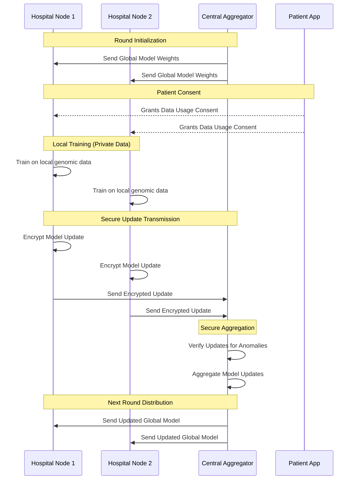

# FederiGene Project Report

## 1. Abstract
The advancement of genomic AI holds immense potential for disease prediction and personalized medicine; however, its progress is significantly hindered by data silos and strict privacy regulations protecting sensitive genetic information. Conventional machine learning approaches require centralized data collection, posing high risks of privacy breaches and regulatory non-compliance. This paper describes FederiGene, a privacy-preserving federated learning platform designed for collaborative genomic AI. The platform enables multiple institutions to collaboratively train robust disease prediction models without ever sharing raw genetic data. Utilizing secure aggregation, update verification, and distributed model training algorithms, FederiGene ensures that only mathematical model updates are transmitted. The system consists of local institutional nodes, a secure central aggregator, and comprehensive frontend/backend interfaces for seamless integration. The proposed solution is scalable, secure, and user-centric, making it suitable for hospitals, research institutions, and individual patients. FederiGene fills crucial gaps in existing healthcare AI technologies by offering an adaptive, privacy-first intervention aimed at enhancing genomic research, accelerating collaborative discoveries, and promoting secure, decentralized healthcare innovation.

## 2. Executive summary
Genomic data analysis is crucial for modern healthcare, but institutions struggle to collaborate due to stringent data privacy laws (e.g., HIPAA, GDPR) and the inherent sensitivity of genetic information. Existing AI solutions are primarily centralized, requiring institutions to pool patient data, which creates significant legal and security bottlenecks. This gap emphasizes the necessity for a software platform that can facilitate collaborative model training while guaranteeing data locality and patient privacy.

FederiGene addresses this need through advanced federated learning and secure aggregation technologies. The platform utilizes local institutional nodes to process genomic data and train models locally. A central backend infrastructure coordinates these nodes, aggregating their cryptographic model updates to form a superior global model without exposing any underlying patient data. The system features a comprehensive technology stack, including a robust backend for aggregation, an intuitive frontend for institutional monitoring, and an SDK for seamless integration into existing hospital systems.

The platform is designed to be highly scalable and resilient, incorporating update verification mechanisms to protect against malicious or anomalous model updates. An integrated Patient App also ensures that individuals have transparency and control over how their data contributes to the research.

Overall, this study demonstrates the use of distributed computing and privacy-preserving AI to handle a real-world healthcare challenge. The suggested system provides a secure, low-cost, decentralized solution for enhancing collaborative genomic AI, making it ideal for clinical research, institutional collaboration, and future developments in bioinformatics.

## 3. Introduction
Genomic AI is essential for predicting disease susceptibility, discovering biomarkers, and developing targeted therapeutics. However, the requirement for massive, diverse datasets to train accurate models directly conflicts with the imperative to protect highly sensitive patient genetic information. Data silos prevent institutions from collaborating, limiting the generalization and accuracy of predictive models. Effective collaboration necessitates not only advanced machine learning algorithms, but also continuous, cryptographically secure data pipelines to retrain models without moving the data. Recent advances in federated learning have enabled the creation of distributed systems capable of training models across decentralized devices. However, many existing solutions lack the specialized security measures, auditability, or user interfaces required for healthcare environments. To address these constraints, this research introduces FederiGene, a privacy-preserving federated learning platform for collaborative genomic AI. The suggested system intends to improve model accuracy and institutional collaboration by combining secure aggregation, update verification, and an intuitive software ecosystem, thereby supporting effective genomic research in highly regulated environments.

### 3.1 Problem Statement
Stringent privacy regulations and data silos are typical barriers to collaborative genomic research, and current centralized machine learning techniques do not provide the necessary data privacy to address these cross-institutional collaboration issues. In order to increase AI accuracy and lower the chance of data breaches, a scalable and secure software solution that can continually train models across decentralized data sources without sharing raw patient information is required.

### 3.2 Gap Analysis
1. No privacy-first, domain-specific collaborative AI tools for genomics.
2. Limited secure aggregation and update verification in existing open-source frameworks.
3. Lack of end-to-end platforms bridging institutional researchers and individual patients.

### 3.3 Purpose
To design and develop a privacy-preserving federated learning platform that enhances collaborative genomic AI, enabling multiple institutions to train disease prediction models, strengthen data security, and eliminate the likelihood of exposing sensitive patient information.

### 3.4 Scope
The development of a secure federated learning software platform to enhance collaborative genomic AI is part of this project's scope. It includes institutional node deployment, secure aggregation via a central backend, and customized model training using distributed algorithms. Additionally, the concept incorporates real-time monitoring via a frontend dashboard, anomaly detection for model updates, and a Patient App for user transparency and data contribution management.

## 4. Designing and engineering standards
### General Healthcare and Data Privacy Standards
1. **HIPAA (Health Insurance Portability and Accountability Act)**
Provides a framework for protecting sensitive patient health information from being disclosed without the patient's consent or knowledge. Applies directly to the handling of genomic data at institutional nodes.
2. **GDPR (General Data Protection Regulation)**
Guides the identification, evaluation, and mitigation of data privacy risks, specifically addressing the rights of individuals regarding their genetic data and the "right to be forgotten."

### Information Security and Software Standards
1. **ISO/IEC 27001 - Information Security Management**
Applicable to the backend servers and institutional nodes to ensure secure handling, encryption in transit and at rest, and robust access controls.
2. **IEEE P3652.1 - Guide for Architectural Framework and Application of Federated Machine Learning**
Relevant for the architectural design of the federated learning system, ensuring standardized communication between the central aggregator and local nodes.
3. **ISO/IEC 27701 - Privacy Information Management**
Ensures the software architecture inherently supports privacy-by-design principles throughout the data lifecycle.

### API and Data Interoperability Standards
1. **HL7 / FHIR (Fast Healthcare Interoperability Resources)**
Used to validate and standardize the format in which healthcare institutions extract and preprocess genomic and clinical data for the local training nodes.
2. **RESTful/GraphQL API Standards**
Ensures the consistency and reliability of communication between the Frontend dashboard, Patient App, and Backend aggregator.

### Software Lifecycle and Reliability
1. **ISO/IEC/IEEE 12207 - Systems and software engineering — Software life cycle processes**
Applicable to the agile development of the Frontend, Backend, SDK, and Patient App.
2. **OWASP Top 10 Security Guidelines**
Crucial for securing the web applications (Frontend) and API endpoints against common vulnerabilities such as injection, broken authentication, and cross-site scripting.

## 5. Identified problems and solutions
### 5.1 Problem: Genomic data is siloed across institutions due to strict privacy regulations, limiting AI model accuracy.
**Solution:** To enhance model robustness without compromising privacy, the platform uses Federated Learning, where models travel to the data, rather than the data traveling to a central server.

### 5.2 Problem: Centralized aggregation of model updates can still be vulnerable to inference attacks or data reconstruction.
**Solution:** Continuous use of Secure Aggregation and cryptographic techniques ensures that the central server only sees the aggregated global update, protecting individual institutional contributions.

### 5.3 Problem: Malicious or anomalous nodes could inject bad data to corrupt the global AI model (data poisoning).
**Solution:** Integrated update verification algorithms gather, evaluate, and filter out anomalous model weights before they are applied to the global model, ensuring system integrity.

## 6. Product Description
A comprehensive software platform called FederiGene combines federated learning algorithms, secure aggregation, and distributed computing to enhance collaborative genomic AI. It uses a decentralized architecture to identify predictive patterns in genomics, applies controlled model updates to a global server, and modifies training parameters in response to network conditions in real time. For institutions with large genomic datasets or research networks requiring collaboration, this privacy-preserving mechanism improves AI accuracy, fortifies data security, and aids in rapid medical discovery.

### 6.1 Process workflow
1. **Node Initialization & Authentication:** Institutions deploy the FederiGene SDK and authenticate with the central backend.
2. **Local Data Preprocessing:** Genomic data is formatted locally using standard pipelines (e.g., VCF files to tensor inputs).
3. **Local Model Training:** The global model weights are downloaded, and the model is trained on the local private dataset.
4. **Encrypted Update Transmission:** Local model weight changes (gradients) are encrypted and sent to the central backend.
5. **Secure Aggregation & Verification:** The backend verifies updates for anomalies and aggregates them securely.
6. **Global Model Update:** The global model is updated with the aggregated weights.
7. **Redistribution:** The improved global model is sent back to all institutional nodes for the next round of training.
8. **Monitoring:** Progress and model accuracy metrics are visualized on the Frontend dashboard.

## 7. Competitive Analysis

| Competitor | Competitor Type | Product offering | Target Audience | Unique value proposition |
| :--- | :--- | :--- | :--- | :--- |
| **Traditional Centralized ML Platforms (AWS, GCP)** | Cloud ML Platform | Centralized data lakes and ML compute environments. | Tech companies, large enterprises. | Massive compute power and integrated tools; requires data centralization (low privacy). |
| **Open-Source FL Frameworks (Flower, PySyft)** | Software Library | Code libraries for building custom federated learning systems. | Developers, academic researchers. | Highly customizable and free; requires significant engineering to build a production-ready medical platform. |
| **FederiGene (Our Product)** | End-to-End Healthcare FL Platform | Turnkey federated learning platform with secure aggregation, GUI, and SDK specifically for genomic data. | Hospitals, research institutes, genomics labs. | Out-of-the-box compliance, update verification, domain-specific for genomics, and integrated Patient App for consent tracking. |

## 8. Design and Prototyping
*(Note: In the final document, include your UI wireframes, architecture diagrams, and sequence diagrams here.)*

* **Fig 8.1:** System Architecture Diagram (showing Backend, Frontend, SDK, and Patient App interactions).

* **Fig 8.2:** Frontend Dashboard Wireframes (showing model training progress, node status, and accuracy metrics).
* **Fig 8.3:** Sequence Diagram for Secure Aggregation Workflow.

## 9. Product Uniqueness
1. **Genomics-Specific Optimization:** Unlike general federated learning tools, it targets genomic data structures and biomedical use cases for precise predictive modeling.
2. **End-to-End Privacy Ecosystem:** Comprehensive system encompassing the institutional training node, the central aggregator, and the patient-facing app for consent.
3. **Robust Security & Verification:** Offers advanced update verification and secure aggregation to prevent data poisoning and inference attacks out-of-the-box.

## 10. Conclusion
The FederiGene platform combines advanced federated learning with secure cryptographic aggregation to provide a unique software solution for enhancing collaborative genomic AI. The product offers scalable, privacy-preserving model training for disease prediction and medical research by overcoming important shortcomings of traditional centralized machine learning techniques. It is appropriate for hospitals, research institutions, and bioinformatics experts because of its secure architecture and regulatory compliance, which promotes broader collaboration, faster scientific discovery, and a higher standard of patient data protection.

## 11. References
1. McMahan, B., Moore, E., Ramage, D., Hampson, S., & y Arcas, B. A. (2017). Communication-efficient learning of deep networks from decentralized data. *Artificial intelligence and statistics* (pp. 1273-1282). PMLR.
2. Bonawitz, K., Ivanov, V., Kreuter, B., Marcedone, A., McMahan, H. B., Patel, S., ... & y Arcas, B. A. (2017). Practical secure aggregation for privacy-preserving machine learning. *Proceedings of the 2017 ACM SIGSAC Conference on Computer and Communications Security* (pp. 1175-1191).
3. Brisimi, T. S., Chen, R., Mela, T., Olshevsky, A., Paschalidis, I. C., & Shi, W. (2018). Federated learning of predictive models from federated electronic health records. *International journal of medical informatics*, 112, 59-67.
4. Li, T., Sahu, A. K., Talwalkar, A., & Smith, V. (2020). Federated learning: Challenges, methods, and future directions. *IEEE signal processing magazine*, 37(3), 50-60.
5. Kaissis, G. A., Makowski, M. R., Rückert, D., & Braren, R. F. (2020). Secure, privacy-preserving and federated machine learning in medical imaging. *Nature Machine Intelligence*, 2(6), 305-311.
