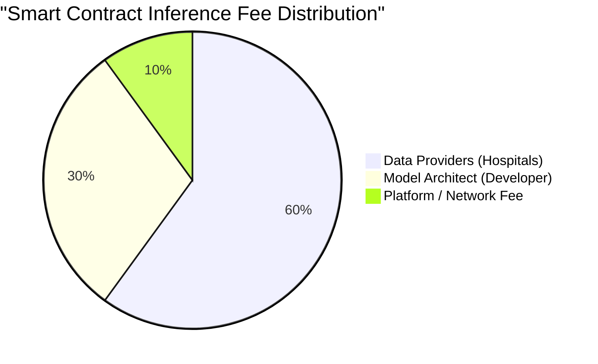

# FederiGene: A Decentralized Protocol for Privacy-Preserving Genomic Artificial Intelligence

## Abstract
The application of deep learning in genomics presents a paradox: achieving high generalizability requires massive, diverse datasets, yet stringent global privacy frameworks (HIPAA, GDPR) strictly prohibit the centralization of patient genomic data. **FederiGene** introduces a novel, decentralized protocol that utilizes Federated Learning (FL), Homomorphic Encryption (HE), and Differential Privacy (DP) to train high-performance genomic AI models across isolated clinical silos. Furthermore, FederiGene introduces a native tokenomics ecosystem (FedCoin) governed by simulated smart contracts to automatically distribute API licensing revenue to data-providing institutions, establishing a self-sustaining economy for collaborative medical research.

---

## 1. Introduction & The Data Silo Problem
Modern deep learning architectures, such as Vision Transformers (ViTs) and deep ResNets, require immense amounts of data to avoid overfitting, especially in high-dimensional domains like genomics. However, hospitals operate as localized data silos. Centralizing this data introduces severe attack vectors and violates patient confidentiality laws. 

FederiGene solves this by inverting the paradigm: **bringing the computation to the data, rather than the data to the computation.**

---

## 2. Protocol Architecture & Topology

FederiGene operates on a star-topology federated learning architecture, orchestrated by a central, untrusted aggregator server.

```mermaid
graph TD
    subgraph Hospital A (New York)
        A_Data[(Raw Genomic Data)]
        A_Model[Local Model A]
        A_Data --> A_Model
    end

    subgraph Hospital B (London)
        B_Data[(Raw Genomic Data)]
        B_Model[Local Model B]
        B_Data --> B_Model
    end

    subgraph Hospital C (Tokyo)
        C_Data[(Raw Genomic Data)]
        C_Model[Local Model C]
        C_Data --> C_Model
    end

    subgraph FederiGene Orchestrator
        Agg[FedAvg Aggregator]
        Registry[(Immutable Model Registry)]
    end

    A_Model -- Encrypted Gradients --> Agg
    B_Model -- Encrypted Gradients --> Agg
    C_Model -- Encrypted Gradients --> Agg
    
    Agg -- Updated Global Weights --> A_Model
    Agg -- Updated Global Weights --> B_Model
    Agg -- Updated Global Weights --> C_Model
    
    Agg -.-> |Final Model| Registry
```

### 2.1 The FedAvg Aggregation Lifecycle
1. **Initialization:** The orchestrator broadcasts a globally initialized PyTorch model to all participating nodes.
2. **Local Training:** Each node trains the model locally using its proprietary dataset for `E` epochs.
3. **Transmission:** Nodes compute the gradient updates ($\Delta W$), encrypt them, and transmit them to the Orchestrator.
4. **Aggregation:** The Orchestrator applies the Federated Averaging (`FedAvg`) algorithm, computing the weighted average of the gradients based on local dataset sizes.
5. **Redistribution:** The updated global weights are returned to the nodes, and the cycle repeats until convergence.

---

## 3. Cryptographic Privacy Mechanisms

To prevent sophisticated attack vectors such as **Model Inversion** and **Membership Inference Attacks**, FederiGene enforces multi-layered cryptography on all transmitted weights.

### 3.1 Differential Privacy (DP)
Before a hospital transmits its local gradients, the FederiGene client injects calibrated statistical noise (e.g., Gaussian noise) bounded by a privacy budget ($\epsilon, \delta$). This ensures that the presence or absence of any single patient's genome does not statistically alter the output of the global model.

### 3.2 Homomorphic Encryption (HE) Latent Spaces
Standard encryption requires decryption before mathematical operations can be performed. FederiGene utilizes **Partially Homomorphic Encryption (PHE)** schemes (such as the Paillier cryptosystem), which allows the central orchestrator to compute the sum and average of the gradient matrices *while they are still encrypted*. The orchestrator never sees the raw, unencrypted weights.

---

## 4. Federated Edge Optimization Pipeline

Genomic AI models are heavily parameterized. Deploying these models into clinical workflows (e.g., local diagnostic machines or mobile devices) requires extreme efficiency. 

> [!TIP]
> **Edge Optimizer Engine**
> FederiGene features an automated pipeline that compresses global models immediately upon training completion using PyTorch's native optimization libraries.

1. **Dynamic Quantization:** The precision of the neural network weights is reduced from 32-bit floating-point (FP32) to 8-bit integers (INT8). This slashes the model footprint by 4x and dramatically accelerates CPU inference without significantly harming the Area Under the Curve (AUC).
2. **Unstructured L1 Pruning:** The optimizer identifies and zeroes out the neural connections (weights) that have the smallest absolute magnitude (L1 norm), removing up to 30% of the model's complexity.

---

## 5. Tokenomics & The FedCoin Ecosystem

Without economic incentives, cross-institutional collaboration is difficult to sustain. FederiGene introduces **FedCoin**, a utility token designed to reward data providers.

### 5.1 Smart Contract Revenue Split
When a finished model is pushed to the **Commercial Marketplace**, third-party researchers and pharma companies can query the model via API. Every inference call requires payment in FedCoin.



* **Passive Data Dividends (60%):** If Hospital A provided 40% of the training data and Hospital B provided 60%, they automatically receive proportional cuts of the API revenue.
* **Developer Bounty (30%):** The institution that designed the architecture and initiated the training job is rewarded for their intellectual property.

---

## 6. Clinical Use Case: Oncology Predictive Modeling

**Scenario:** A consortium of three distinct cancer research centers wants to train a model predicting patient response to a novel immunotherapy drug based on RNA-seq expression profiles.

1. **Setup:** The coordinating center initiates a training job (`Job #102: Immunotherapy Response ViT`).
2. **Federated Training:** Centers in the US, EU, and Asia participate. Their localized data remains entirely on-premise, bypassing international data transfer laws (GDPR).
3. **Publishing:** The resulting model achieves an impressive 0.94 AUC. The coordinator publishes it to the FederiGene Commercial Registry.
4. **Monetization:** A pharmaceutical company pays 0.05 FedCoin per inference to test thousands of simulated patient profiles against the model via API. The smart contract instantly routes revenue back to the three research centers, funding their ongoing clinical operations.

---

## 7. Security and Compliance Alignment

> [!IMPORTANT]
> **Regulatory Alignment**
> FederiGene is engineered to map directly to the stringent requirements of healthcare data compliance.

* **Zero-Knowledge Identity:** Organizations authenticate without exposing internal network topologies or active directory metadata.
* **HIPAA/GDPR Compliance:** Because raw Protected Health Information (PHI) and Personally Identifiable Information (PII) never traverse the network, the system falls entirely outside the standard liabilities of centralized data pooling.
* **Cryptographic Signatures (HMAC):** Every model pushed to the registry is hashed and signed. If a malicious actor attempts to tamper with the model weights on the network, the signature validation fails, ensuring clinical integrity.

---

## 8. Conclusion

FederiGene represents the transition from isolated, localized medical AI to a globally collaborative intelligence network. By merging the technical breakthroughs of Federated Learning and Cryptography with the economic incentives of decentralized tokenomics, FederiGene permanently solves the genomic data privacy crisis, accelerating the advent of true precision medicine.
